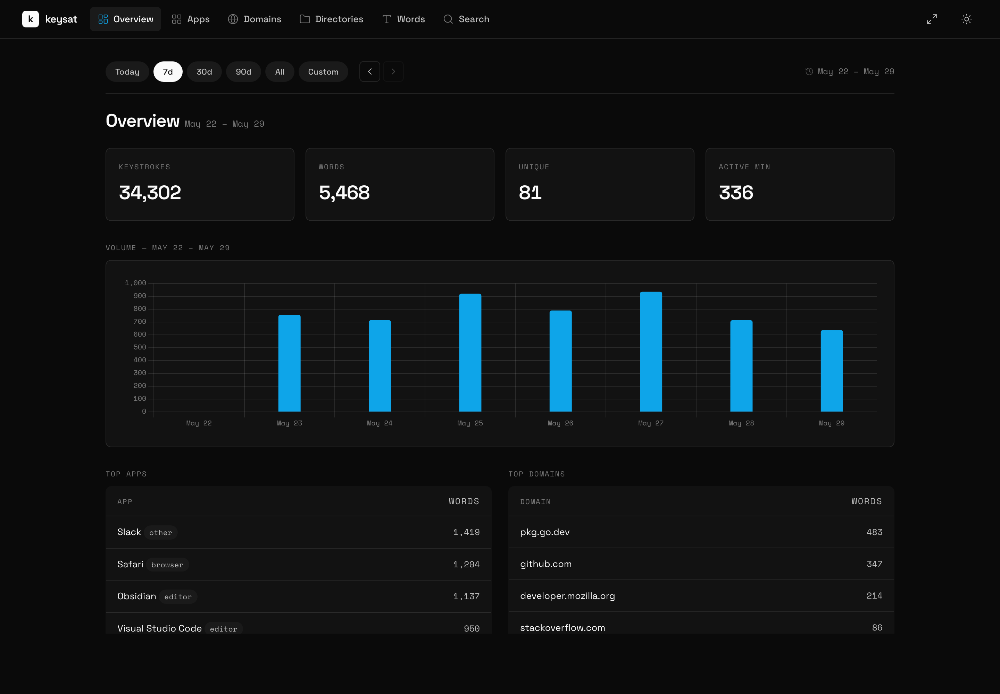
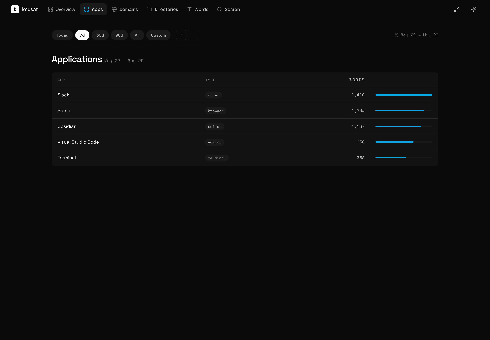
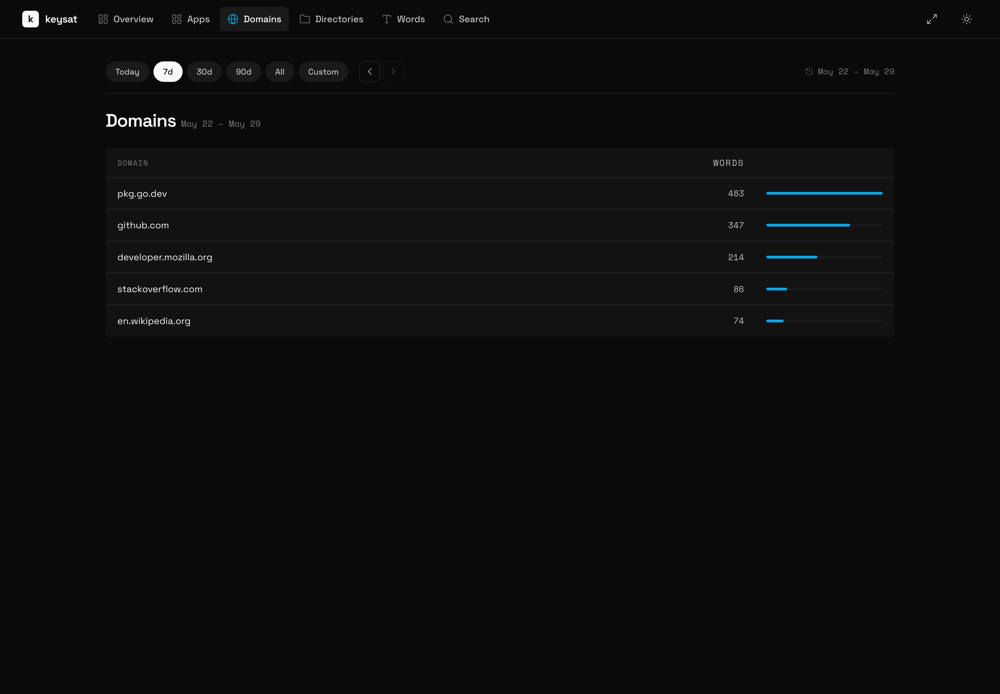
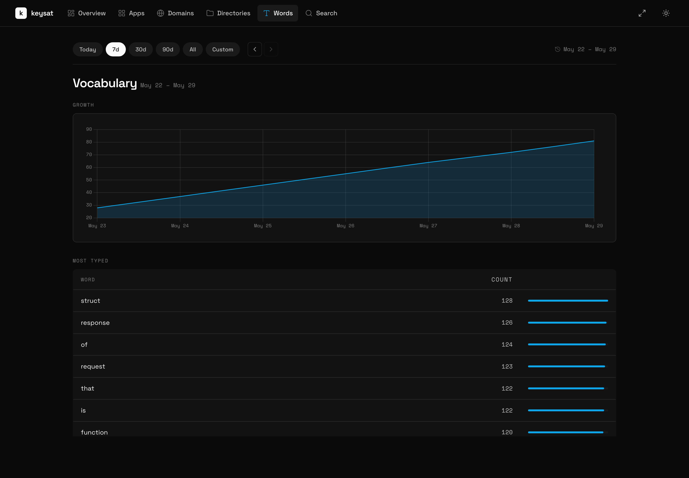

<div align="center">

# keysat

**A local-first keystroke & activity tracker for macOS.**
Every word you type, organized by app, domain, and directory — searchable, charted, and never leaving your machine.



[](LICENSE)


</div>

---

## What it is

keysat is a small background daemon that quietly records the words you type and the context you type them in — which application, which website, which project directory — and stores everything in a local SQLite database. A built-in web dashboard then lets you explore your own typing: how much you wrote today, your most-used apps and domains, how your vocabulary grows over time, and a full-text search across your entire history.

It's a self-quantification tool. **All data stays on your machine** (`~/.keysat/keysat.db`) and is never sent anywhere. Password-like input is detected and stored only as a one-way hash, never in clear text.

> **Heads up:** keysat captures what you type. Run it only on your own machine, for your own data. See [Privacy](#privacy).

## Highlights

- **Live dashboard** — keystrokes, words, unique words, and active minutes at a glance, with a volume chart that adapts to whatever time window you pick.
- **Context everywhere** — activity is attributed to the **app**, **web domain** (via a tiny Chrome extension), and **working directory** (via a shell hook).
- **Real search** — crash-proof full-text search with prefix matching, scoped to any date range, filterable by app or domain, paginated.
- **Time travel** — a global range bar (Today · 7d · 30d · 90d · All · Custom) with day-by-day navigation that drives every page.
- **Vocabulary growth** — track new vs. cumulative unique words over time.
- **Light & dark** — built on the [Deb Design System](#design): Space Grotesk + Space Mono, Sky accent, hairline borders. Fonts and icons are vendored, so it works fully offline.

## Screenshots

| Applications | Domains | Vocabulary |
|---|---|---|
|  |  |  |

<sub>Screenshots use synthetic demo data.</sub>

## How it works

```
  ┌─────────────┐   keystrokes    ┌──────────────┐   words+context   ┌────────────┐
  │  CGEventTap │ ──────────────▶ │   pipeline   │ ────────────────▶ │   SQLite   │
  │  (macOS)    │                 │ capture→word │                   │  + FTS5    │
  └─────────────┘                 │  →context    │                   └─────┬──────┘
                                   └──────▲───────┘                         │
   Chrome ext ─ active domain ──────────┘ │ cwd ── shell hook               │ embedded
                                           │                                 ▼
                                   ┌────────────────┐  HTTP :7890   ┌──────────────────┐
                                   │ context resolver│ ───────────▶ │  web dashboard   │
                                   └────────────────┘               │ (Alpine + Chart) │
                                                                     └──────────────────┘
```

- **`cmd/keysatd`** — the daemon entry point.
- **`internal/capture`** — keystroke capture (macOS event tap) and word assembly; detects and hashes password-like input.
- **`internal/context`** — resolves the active app, browser domain, and working directory.
- **`internal/pipeline`** — wires capture → words → context → storage, batching writes.
- **`internal/storage`** — SQLite schema, sessions, words, FTS5 search, and aggregated stats.
- **`internal/web`** — embedded HTTP server + the single-page dashboard (`static/`).
- **`extension/`** — Chrome extension that reports the current tab's domain.
- **`shell/keysat-hook.sh`** — shell hook that reports your current working directory.

## Requirements

- **macOS** (uses a Core Graphics event tap).
- **Go 1.25+** with CGO enabled (the SQLite driver and FTS5 search need it).
- **Accessibility / Input Monitoring** permission for the app that runs the daemon.

## Build & run

```bash
# clone
git clone https://github.com/sudiptadeb/keysat.git
cd keysat

# build (the fts5 build tag enables full-text search)
go build -tags fts5 -o keysatd ./cmd/keysatd

# run
./keysatd
```

Then open the dashboard at **http://127.0.0.1:7890**.

The first time you run it, macOS will ask for Accessibility permission so keysat can observe keystrokes. Grant it under **System Settings → Privacy & Security → Accessibility** (and **Input Monitoring**).

### Run as a background service

First, create a stable self-signed signing identity (one-time). Ad-hoc signing
changes identity on every rebuild and makes macOS drop the Accessibility /
Input Monitoring grant; a stable identity keeps it across rebuilds:

```bash
make cert            # creates the "keysat-dev" code-signing identity
```

Then run the daemon **from your terminal** so it lives inside your GUI login
session and can attribute typing to the focused app (a plain `launchd` agent
does not see the frontmost application, so everything ends up under the browser):

```bash
make bg              # build, sign, and run in the background
make logs            # tail the logs
make stop-service    # stop
```

Grant **Accessibility** and **Input Monitoring** to `KeySat.app` the first time
under System Settings → Privacy & Security. Thanks to the stable identity, you
only do this once.

### Just view the dashboard

To browse your stats without running capture (no permissions needed):

```bash
make web             # serves the dashboard read-only on http://127.0.0.1:7890
```

### Optional integrations

```bash
# report the active browser domain
make install-extension   # then load extension/ as an unpacked Chrome extension

# report your shell's working directory — add to ~/.zshrc or ~/.bashrc:
source /path/to/keysat/shell/keysat-hook.sh
```

### Preview the dashboard without capturing

`cmd/keysat-webtest` serves the dashboard against your existing database without starting the capture pipeline — handy for development or just browsing your stats:

```bash
go build -tags fts5 -o keysat-webtest ./cmd/keysat-webtest
./keysat-webtest -addr 127.0.0.1:7899
```

## Privacy

- **Local only.** Everything is written to `~/.keysat/keysat.db` on your machine. There is no telemetry, no sync, no network egress.
- **Passwords are not stored in clear text.** Input that looks like a password (e.g. in secure fields) is detected and stored as a hash, flagged with `is_hashed`, and excluded from vocabulary and search.
- The database, logs, and runtime sockets are git-ignored and never committed.

## Design

The dashboard follows the **Deb Design System** — a crisp, layered, single-accent system. Surface tokens, Space Grotesk / Space Mono type, and Lucide icons are vendored locally (`internal/web/static/`), so the UI renders correctly with no internet connection.

## License

[MIT](LICENSE) © 2026 Sudipta Deb
